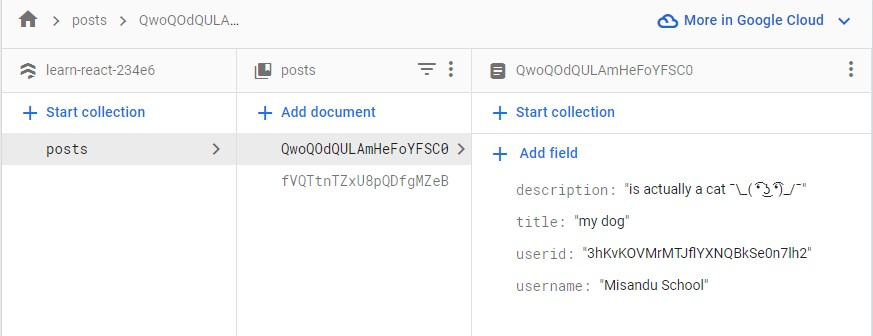

<br><br>

- [About the app](#about-the-app)
  - [Setting up firebase api](#setting-up-firebase-api)
  - [Setting up firebase in app](#setting-up-firebase-in-app)
  - [Adding login functions](#adding-login-functions)
  - [Showing user details on navigation bar](#showing-user-details-on-navigation-bar)
  - [Final look](#final-look)
  - [Creating firestore database](#creating-firestore-database)
  - [Configuring db in api](#configuring-db-in-api)
  - [Setting up form to enter data](#setting-up-form-to-enter-data)
  - [setting up writting database from form inputs](#setting-up-writting-database-from-form-inputs)

<br><br>

# About the app
In this app we are making a social media like web app and  focusing on authentication using firebase. [Firebase](https://firebase.google.com/) is a google tool that helps with signing/authentication for many applications. Also later we will configure the app to communicate with firebase database called Firestore, which we will go indepth later on.

## Setting up firebase api

First you have to install firebase library to you project,

```powershell
npm install firebase
```

Then create a file that connect to the firebase api. In our case we named it **firebase.ts**. Note that the file extension is *.ts* rather than its *.tsx* since its not a component (do not return any **JSX**).

After that head on to firebase website and create project and name the app. This will provide you with the api call code. Paste that into **firebase.ts** file. This will navigate to app's dashboard that will look like this,


Now head over to authentication panel and select google and confirm the changes. 

## Setting up firebase in app

After that we have to import two other libraries into the **firebase.ts** file,
```javascript
import { initializeApp } from "firebase/app";
import {getAuth, GoogleAuthProvider} from 'firebase/auth';
```
First import here is for initialising the app and the second one for authentication with the google provider. Then add the folloing code as well,

```javascript
export const auth = getAuth(app);
export const provider = new GoogleAuthProvider();
```
In here we are creating auth const that get the authentication from the app. Then sending it though the *GoogleAuthProvider*.

So far **firebase.ts** file's code will look like this,
```javascript
// Import the functions you need from the SDKs you need
import { initializeApp } from "firebase/app";
import {getAuth, GoogleAuthProvider} from 'firebase/auth';
// TODO: Add SDKs for Firebase products that you want to use
// https://firebase.google.com/docs/web/setup#available-libraries

// Your web app's Firebase configuration
const firebaseConfig = {
  apiKey: "dgdg",
  authDomain: "learn-react-234e6.firebaseapp.com",
  projectId: "learn-react-234e6",
  storageBucket: "learn-react-234e6.appspot.com",
  messagingSenderId: "1041559860762",
  appId: "dgdsgdsgdg"
};

// Initialize Firebase
const app = initializeApp(firebaseConfig);

export const auth = getAuth(app);
export const provider = new GoogleAuthProvider();
```

> Note that the api key some other information will be different for other users.

## Adding login functions

Then head over to **login.tsx** file to add the signing functionality to our *sign in button*.

Then we are going to import some libraries to this file,
```javascript
import { auth, provider } from '../config/firebase'
import { signInWithPopup } from 'firebase/auth'
import { useNavigate } from 'react-router-dom'
```
First we have imported the *auth* and *provider* configuration from our **firebase.ts** file. Second, the sign in functionality, which is in our case a sign in pop up from that display google accounts. Then `useNavigate` to navigate to specific file after the authentication. 

```javascript
import { auth, provider } from '../config/firebase'
import { signInWithPopup } from 'firebase/auth'
import { useNavigate } from 'react-router-dom'


export const Login = () => {
    const navigate = useNavigate();

    const googleSignin = async () => {
        const result = await signInWithPopup(auth, provider);
        console.log(result);
        navigate('/')
    }

    return (
        <div>
            <h1>
                This is Login Page~
            </h1>
            <p>
                sign in with google
            </p>
            <button onClick={googleSignin}>
                sign in
            </button>
        </div>
    )
}
```
Then we make a function called `googleSignin` that calls `signInWithPopup` fuction and pass in the *auth* and *provider* variables. Then we set the `navigate` to the *home page* after authentication. finally we set the button to run the `googleSignin` function onclick. When we run the app now we can see in console all the user details there.

## Showing user details on navigation bar

Now we show those user details in the navigation bar by adding some code into the **navbar.txs**. First we import the following libraries,

```javascript
import { Link } from 'react-router-dom'
import { auth } from '../config/firebase'
import { useAuthState } from 'react-firebase-hooks/auth';
import { signOut } from 'firebase/auth'
```

You may have to install the page called `react-firebase-hooks`.
```powershell
npm install react-firebase-hooks
```
Then we add the following code to the file,
```javascript
import { Link } from 'react-router-dom'
import { auth } from '../config/firebase'
import { useAuthState } from 'react-firebase-hooks/auth';
import { signOut } from 'firebase/auth'


export const Navbar = () => {
    const [user] = useAuthState(auth);
    const logOut = async () => {
        await signOut(auth);
    }

    return (
        <nav>
            <Link to={'/'}>Home</Link>
            <Link to={'/login'}> Login</Link>
            <div className="navbar-container">
                {user && (
                <>
                    <p>{user?.displayName}</p>
                
                <button onClick={logOut}>log out</button>
                </>
                )}
                
            </div>
        </nav>

    )
}
```
So what `useAuthState` hook does is, it allow the user to change the account and it updates the page instantly on the web page.

We also have added logout functionality so the user can log out of the account. for this we have used the `signOut` hook from *firebase/auth* library. Then we have updated the UI to display name of the user, the user image and a log out button.

## Final look

After adding some css into the app, your app might look like this,


> Ignore my desktop pet 凸 ( ͡❛ ω ͡❛)凸


## Creating firestore database
Now to create the firestore database we have to head back over to [Firebase](https://firebase.google.com/) website and navigate to our previously made project. In here click on build>firestore-database.


Then we will create production database and confirm settings. In here we will create a new collection with required columns. something like this (doesnt really need to be exactly same, you can add some random values for values field). 


Once we have done that we need to head over to **Rules** section to change persmission that who can and cannot read write to this data collection.


In here edit the code to for custom permissions and publish it,
```
rules_version = '2';
service cloud.firestore {
  match /databases/{database}/documents {
    match /{document=**} {
      allow read : if request.auth != null;
      allow write: if request.auth != null && request.auth.uid == request.resource.data.userid;
    }
  }
}
```
## Configuring db in api
Now we can head over to **firebase.tsx** file and add some more code so that it will be able to talk to the *Database*.

```javascript
import {getFirestore} from 'firebase/firestore'

...

export const db = getFirestore(app);
```
We need to import `getFirestore` hook from firestore library and pass in *app* to it.

## Setting up form to enter data
In the project /src we are creating another folder called **/create-post** and creating two other files inside it called **CreatePost.tsx** and **CreateForm.tsx**. CreatePost will be used show the creating post page and the form it self will be coded in CreateForm page. Before moving further lets create a another **Route** in app.tsx so we can navigate easily.

Now in the CreatePost page add these code to show the form and import the CreateForm.tsx as well.

```javascript
import { CreateForm } from "./CreateForm"

export const CreatePost=()=>{
    return (
        <div>
            <CreateForm />
            
        </div>
    )
}
```

Now head over to the CreateForm.tsx file and add this code.
```javascript
import { useForm } from 'react-hook-form';
import * as yup from 'yup';
import { yupResolver } from '@hookform/resolvers/yup';
import {addDoc, collection} from 'firebase/firestore';
import { auth, db } from '../../config/firebase';
import { useAuthState } from 'react-firebase-hooks/auth';
import { useNavigate } from 'react-router-dom';


interface CreateFormData{
    title:string;
    description: string;
}

export const CreateForm = () => {
    const navigate = useNavigate();
    const [user] = useAuthState(auth);

    const schema = yup.object({
        title: yup.string().required("Title required"),
        description: yup.string().required("Desription required"),

    })
    const { register, handleSubmit, formState:{errors}} = useForm<CreateFormData>({
        resolver: yupResolver(schema)
    })

    const postRef = collection(db, "posts");

    const onCreatePost=async(data:CreateFormData)=>{
        await addDoc(postRef, {
            ...data,
            username:user?.displayName,
            userid: user?.uid,
        })
        navigate("/");
    }
    return (

        <div>
            <form onSubmit={handleSubmit(onCreatePost)}>
                <input placeholder='Title.. ' {...register("title")} />
                <p style={{color:"red"}}>{errors.title?.message}</p>
                <textarea placeholder='Description.. ' {...register("description")}/>
                <p style={{color:"red"}}>{errors.description?.message}</p>
                <input type={'submit'} />
            </form>
        </div>
    )
}
```

So first of all we are importing the three libraries that are needed for creating the form. 

```javascript
import { useForm } from 'react-hook-form';
import * as yup from 'yup';
import { yupResolver } from '@hookform/resolvers/yup';
```
You can install these packages using the following commands if they are not installed, 
```powershell
npm install react-hook-form yup @hookform/resolvers
```

Then import two libraries that are required for setting up the database. 

```javascript
import {addDoc, collection} from 'firebase/firestore';
import { auth, db } from '../../config/firebase';
```

The other two imports are for using the userState and navigation,
```javascript
import { useAuthState } from 'react-firebase-hooks/auth';
import { useNavigate } from 'react-router-dom';
```

Then we set up the form using yup, register and reslvers as have discussed in a previous episode.

## setting up writting database from form inputs

Then we move on to the database configuration. 
```javascript
 const postRef = collection(db, "posts");

    const onCreatePost = async (data: CreateFormData) => {
        await addDoc(postRef, {
            ...data,
            username: user?.displayName,
            userid: user?.uid,
        })
        navigate("/");
    }
```

Here in the `collection` method we are passing in the **db** object we created earlier on *firebase.tsx* file and the **"posts"** which is the collection id we created in the *firebase website* to reference to that data collection.

Then we create `createPost` method that will called in when submiting the form. in this method we passing in the inforation *data object*, *username* and *userid* which are the same columns we made in the collection earlier in the website.


> Note that in the image **id** column is not same as in the code for **userid** but it is supposed to be the same to make sure to have same names.

Once this is completed you should be able to add data into the collection and it will be updated in the firestore database via their website.


Here in website it shows results,
